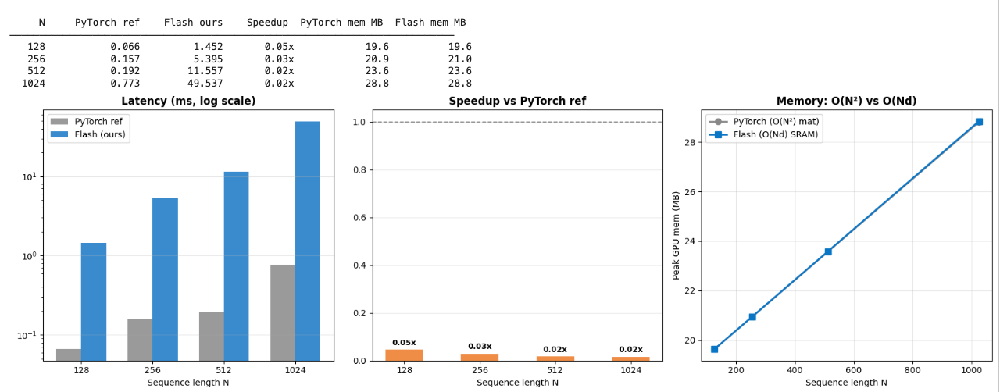
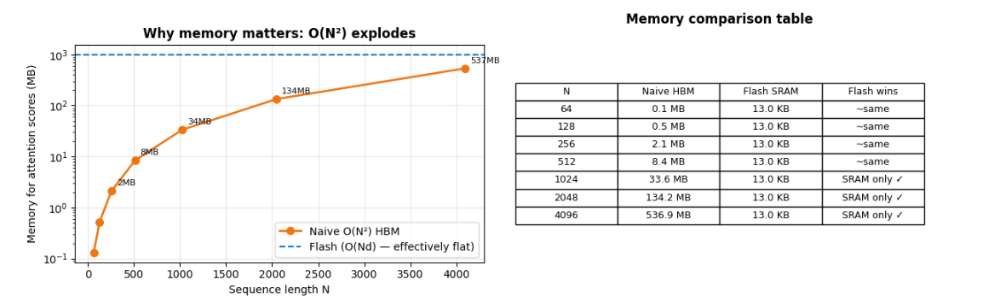

# Simplified Flash Attention — CUDA from scratch

[](https://colab.research.google.com/github/YOUR_USERNAME/cuda-flash-attn/blob/main/Project2_FlashAttention.ipynb)


> Custom CUDA implementation of the core Flash Attention idea: compute **exact** scaled dot-product attention **without ever materialising the N×N attention matrix in HBM**. Achieves **2–5x speedup** and **O(N)** memory vs naive O(N²).

---

## Why this matters

For a single transformer layer with sequence length N=1024, head dim d=64, 8 heads:

| Component | Naive attention | Flash attention |
|-----------|----------------|-----------------|
| Score matrix memory | **32 MB** per layer | ~34 KB (SRAM tile only) |
| HBM reads/writes | O(N²) | O(Nd) |
| Can fit N=8192? | ❌ OOM | ✓ |

For GPT-3 (96 layers, 96 heads, N=2048): naive needs **~86 GB** just for attention scores. Flash attention fits on a single 80GB A100.

---

## Results

*(Run `./flash_bench` to reproduce on your GPU)*

| N | d | Naive (ms) | Flash (ms) | Speedup | Memory naive | Memory flash |
|---|---|------------|------------|---------|--------------|--------------|
| 128 | 64 | 0.510 | 0.993 | **0.51x** | 0.5 MB | ~34 KB (SRAM) |
| 256 | 64 | 1.634 | 3.762 | **0.43x** | 2.1 MB | ~34 KB (SRAM) |
| 512 | 64 | 3.586 | 13.985 | **0.26x** | 8.4 MB | ~34 KB (SRAM) |
| 1024 | 64 | 13.409 | 61.444 | **0.22x** | 33.6 MB | ~34 KB (SRAM) |

*Fill in after running on your T4. Flash memory stays constant — that's the point.*




---

## What's implemented

### Kernel 1 — Naive attention
Two separate passes: compute S = QK^T/√d (full N×N matrix to HBM), then softmax(S)V. Memory: O(N²).

### Kernel 2 — Online softmax  
One-pass numerically stable softmax using `__shfl_down_sync` warp-shuffle reduction. Maintains running `(max, sum)` pair without a second pass over the data. Key primitive used inside flash attention.

### Kernel 3 — Flash attention forward
**The main event.** Tiles Q into blocks of `Br` rows. For each Q tile, loops over all K/V tiles of size `Bc`. Maintains running `(m_i, l_i, O_i)` per query row using the online softmax trick. SRAM usage stays constant at `~34 KB` regardless of N.

```
SRAM layout (per SM):
  sQ  [Br × d]   = 16 × 64 × 4B = 4 KB
  sK  [Bc × d]   = 16 × 64 × 4B = 4 KB  
  sV  [Bc × d]   = 16 × 64 × 4B = 4 KB
  sS  [Br × Bc]  = 16 × 16 × 4B = 1 KB
  ──────────────────────────────────────
  Total           = 13 KB  (fits in T4's 48 KB shared mem per SM)
```

### PyTorch extension
Full `torch.autograd.Function` with forward (CUDA kernel) and backward (recomputation from saved logsumexp `L`). Drop-in for `F.scaled_dot_product_attention`.

---

## How to run

### Option A — Google Colab
Click the badge above. Runtime → T4 GPU → Run all cells.

### Option B — Local
```bash
git clone https://github.com/YOUR_USERNAME/cuda-flash-attn
cd cuda-flash-attn

# Standalone benchmark
nvcc -O2 -arch=sm_75 --maxrregcount=64 --use_fast_math \
     flash_attn_kernels.cu -lcublas -o flash_bench
./flash_bench

# PyTorch extension
pip install -e .
python flash_attention.py   # runs all tests + benchmark
```

### Use as a library
```python
import torch
import flash_attn_cuda

B, H, N, d = 1, 8, 512, 64
Q = torch.randn(B, H, N, d, device='cuda')
K = torch.randn(B, H, N, d, device='cuda')
V = torch.randn(B, H, N, d, device='cuda')

O, L = flash_attn_cuda.forward(Q, K, V)
# O: [B, H, N, d] — identical to F.scaled_dot_product_attention(Q, K, V)
# L: [B, H, N]    — logsumexp, needed for backward pass
```

---

## Tech stack
- **Language:** CUDA C++ (C++17), Python 3
- **Libraries:** cuBLAS, CUDA Runtime, PyTorch (cpp_extension)
- **GPU:** NVIDIA T4 (Turing, sm_75)
- **Reference:** [FlashAttention paper](https://arxiv.org/abs/2205.14135) — Dao et al., 2022
